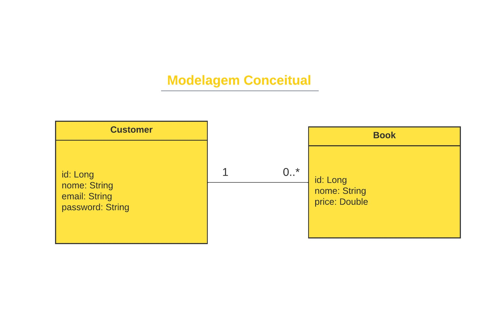
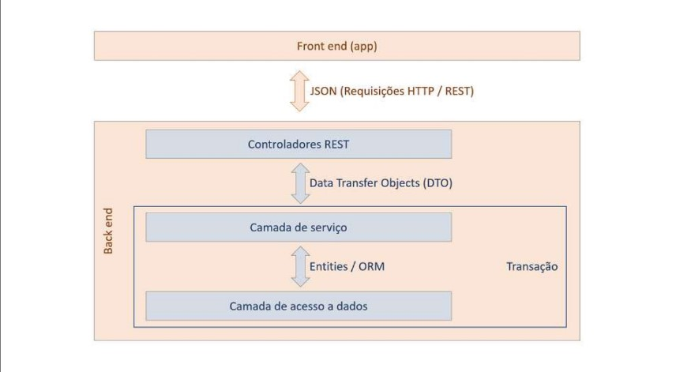

___

# Projeto Linguagem de Programação II - Locadora Livros Backend
O projeto foi desenvolvido para a disciplina de Linguagem de programação II e tem como objetivo apresentar um backend simples em `java`
utilizando o framework `SpringBoot`.

O backend tem como objetivo ser uma API REST do tipo CRUD (Create, Retrieve, Update, Delete), disponibilizando esses métodos em suas requisições.

## Spring Boot
O Spring Boot é um framework Java baseado no Spring Framework, que simplifica o desenvolvimento de aplicações Spring. Ele facilita a configuração e o deployment, permitindo que os desenvolvedores criem aplicativos standalone e de produção prontos rapidamente. Com o Spring Boot, é possível inicializar um projeto com configurações mínimas, graças a recursos como configuração automática, um servidor embutido e uma abordagem "opinionated", que sugere boas práticas.

## Modelagem Conceitual

## Arquitetura do Projeto - Padrão de Camadas 

• Consiste em organizar os componentes do sistema em partes
denominadas camadas
• Cada camada possui uma responsabilidade específica
• Componentes de uma camada só podem depender de
componentes da mesma camada, ou da camada mais abaixo

___

